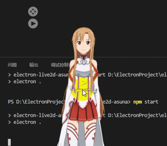
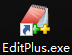
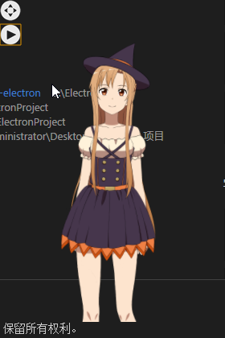

Electron整合live2d实现透明窗口
===========
不废话首先看效果

 


只需写几十行配置的代码
***
在网页显示live2d教程@猫与向日葵-->[给博客添加能动的看板娘(Live2D)-将其添加到网页上吧](https://imjad.cn/archives/lab/add-dynamic-poster-girl-with-live2d-to-your-blog-02)

以及在[ALfheim Online世界树攻略组](http://alfheim.cc/live2d-wallpaper.html)找到的asuna的live2d
***
可能有些同志还不知道[electron](https://electronjs.org/),那就先介绍一下:

electron是可以使用 JavaScript, HTML 和 CSS 编写桌面应用的技术,只需要对前端语言有所了解,即可编写出可在本地执行的桌面应用.
***
ok 开始前先准备
---

 或  或 

搭建electron的开发环境-->[windows下快速搭建electron开发环境](http://blog.chinaunix.net/uid-10062010-id-5751916.html)

不过个人建议使用yarn代替npm-->[npm和yarn的区别，我们该如何选择？](https://zhuanlan.zhihu.com/p/27449990)

***
好的可以正式~~复制~~开发了
---
这里默认你已经可以运行[演示项目](https://github.com/electron/electron-quick-start)

package.json文件
```
{
  "name": "electron-live2d-asuna",
  "version": "1.0.0",
  "description": "A minimal Electron application with live2d",
  "main": "main.js",
  "scripts": {
    "start": "electron ."
  },
  "author": "skyrim894",
  "devDependencies": {
    "electron": "^2.0.2"
  }
}
```

将窗口的属性改为
```
mainWindow = new BrowserWindow({
        height: 360,
        width: 260,
        frame:false,//无边框
        transparent:true//背景透明
    });
```
index.html参考
```
<!DOCTYPE html>
<html lang="en">
<head>
    <meta charset="UTF-8">
    <title>index</title>
    <style type="text/css">
        html,body{
            width: 250px;
            height:300px;
        }

        .waifu {
            padding:0;
            z-index: 1;
            font-size: 0;
            margin-top:50px;
            transition: all .3s ease-in-out;
            -webkit-transform: translateY(3px);
            transform: translateY(3px);
            /* border:2px solid #333; */
        }
        .waifu:hover {
            -webkit-transform: translateY(0);
            transform: translateY(0);
        }
        
        .waifu #live2d{
            position: relative;
        }

        #move{
            -webkit-app-region: drag;
            position: absolute;
            top: 0;
            left: 0;
            width: 26px;
            height: 26px;
            background: url("resources/img/move_hover.png") no-repeat;
            opacity: 0;
            -webkit-transition:0.5s;
        }

        #next_texture{
            position: absolute;
            z-index: 10;
            top: 30px;
            left: 0;
            width: 26px;
            height: 26px;
            border:none;
            background: url("resources/img/run_hover.png") no-repeat;    
            opacity: 0;
            -webkit-transition:0.5s;
        }

        html:hover #next_texture,html:hover #move{
            opacity: 1;
            -webkit-transition:0.5s;
        }
    </style>

</head>
<body>
    <div id="move"></div>
    <input type="button" id="next_texture"/>
<div class="waifu">
    <div class="waifu-tips"></div>
    <canvas id="live2d" width="250" height="300" class="live2d"></canvas>
</div>
<!--必要-->
<script src="resources/js/live2d.js"></script>
<!--非必要-->
<script src="resources/js/jquery.min.js"></script>
<script src="resources/js/index.js"></script>
</body>
</html>
```

> 1.值得注意的是如果本地直接打开html文件的话是看不到效果的,因为存在跨域访问,但electron解决了这个问题
> 2.如果使用了jquery,需要在第一次使用$符前加入这样一段代码

>`if (typeof module === 'object') {window.jQuery = window.$ = module.exports;};`


这样~~我的~~darli就出现在大家的桌面上了



那么问题来了...为什么不装一个[live2dViewer](http://www.live2d.com/usermanual/cubism2_cn/lets-do-it/desktop-mascot/01.html)呢


其实使用js开发最大的好处是方便扩展,你可以很方便的添加自己想要的功能,虽然不 直接操作模型,但加入语音,添加背景,或者一定程度上的文字和语音交互读是不难的!


